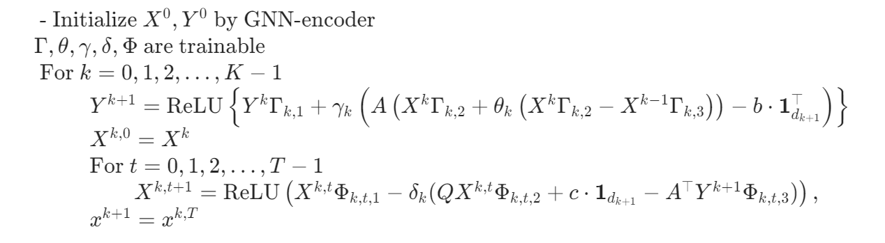

# PDHCG-Net
PDHCG-Net aims to use Neural Networks, inspired by the updating rule of [PDHCG](https://arxiv.org/abs/2405.16160), to warm start QP solvers.

The Neural Network is defined as:


## A Warper of Julia version
This repo contains the Python API of the julia implementation of PDHCG for training neural networks and warm-start efficiency. However, please notice that [PDHCG-Python](https://github.com/Lhongpei/PDHCG-Python) is the latest version of Python API, and **Python API in this repo will not be updated.**

In addition, this repo is designed for converting QP problem between Julia, Numpy and PyTorch and contains tools for batch-processing data for training efficiency.


## License

```.
MIT License

Copyright (c) 2024

Permission is hereby granted, free of charge, to any person obtaining a copy of this software and associated documentation files (the "Software"), to deal in the Software without restriction, including without limitation the rights to use, copy, modify, merge, publish, distribute, sublicense, and/or sell copies of the Software, and to permit persons to whom the Software is furnished to do so, subject to the following conditions:

The above copyright notice and this permission notice shall be included in all copies or substantial portions of the Software.

THE SOFTWARE IS PROVIDED "AS IS", WITHOUT WARRANTY OF ANY KIND, EXPRESS OR IMPLIED, INCLUDING BUT NOT LIMITED TO THE WARRANTIES OF MERCHANTABILITY, FITNESS FOR A PARTICULAR PURPOSE AND NONINFRINGEMENT. IN NO EVENT SHALL THE AUTHORS OR COPYRIGHT HOLDERS BE LIABLE FOR ANY CLAIM, DAMAGES OR OTHER LIABILITY, WHETHER IN AN ACTION OF CONTRACT, TORT OR OTHERWISE, ARISING FROM, OUT OF OR IN CONNECTION WITH THE SOFTWARE OR THE USE OR OTHER DEALINGS IN THE SOFTWARE.
```
